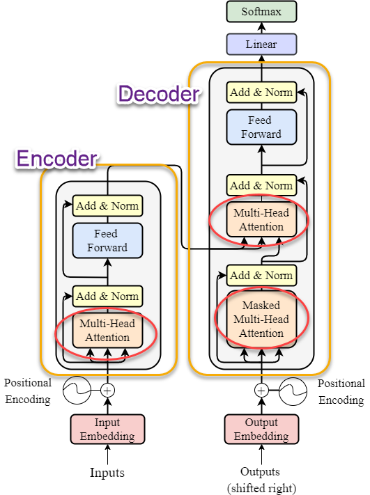

# Attention mechanism

The attention mechanism is like a secret ingredient that empowers the whole transformer architecture. The title of the research paper by Google that highlighted the rise of the transformer model says even "Attention is All You Need" :)

In general, **attention in machine learning is a mechanism that tries to mimic the way cognitive attention in humans work**. It aims to determine what to focus on at a given moment and ignore other things that seem less relevant at the time. 

Before transformer-based language models with the attention mechanism came into being, the standard were the language models based on recurrent or convolutional neural networks.
However, they had 2 major issues:

- the more recent information from the end of the sentence was favored whereas the previous part of the sentence, paragraph etc., which could still be relevant for the context, was "forgotten";
- the data was computed sequentially, which means the words were processed one by one, which made it time-consuming.

The attention mechanism used in the transformer architecture solved the both issues. Firstly, **transformer-based language models have a wide context window and thanks to this they are able to refer to a much larger context**. Secondly, the words are processed simultaneously which saves time.

The attention layers that make it happen are located in the **encoder** and the **decoder**.

<figure>
  
  <figcaption><i>source: https://proceedings.neurips.cc/paper/2017/file/3f5ee243547dee91fbd053c1c4a845aa-Paper.pdf modified</i></figcaption>
</figure>

A lot is happening inside an encoder and a decoder, and that's why we won't go into too much detail because it's beyond the beginner level.

When it comes to the **encoder**, the **multi-head attention** is the mechanism that enables the encoder to concentrate on specific parts of the input. The attention mechanism allows the encoder to attend to different parts of the input sequence when computing the encoded representation. What the language model does here is, basically, making calculations to assess what parts of the input are more important than the others and what are the relationships between them. 

In this way, it mimics what comes naturally to humans - attending to some parts of the sentence, paragraph etc. more than to others. Usually, it's the who, when, and where part of a sentence that draw the most attention.

When it comes to the **decoder**, the **multi-head attention** is the mechanism that enables the decoder to use the insights and context about the input gained by the encoder. The decoder attends to both the encoded representation from the encoder and its own previously generated output. 

The **masked multi-head attention** mechanism on the other hand allows the decoder to concentrate on the elements that were already generated by the decoder itself, for example a part of the translated sentence. The masking is done to prevent the decoder from attending to future tokens that it has not yet generated, which would be a form of cheating.

In this way, the information processed by both the encoder and the decoder and the exchange of information between them, make the final output generated by the decoder well embedded in the context and accurate.
