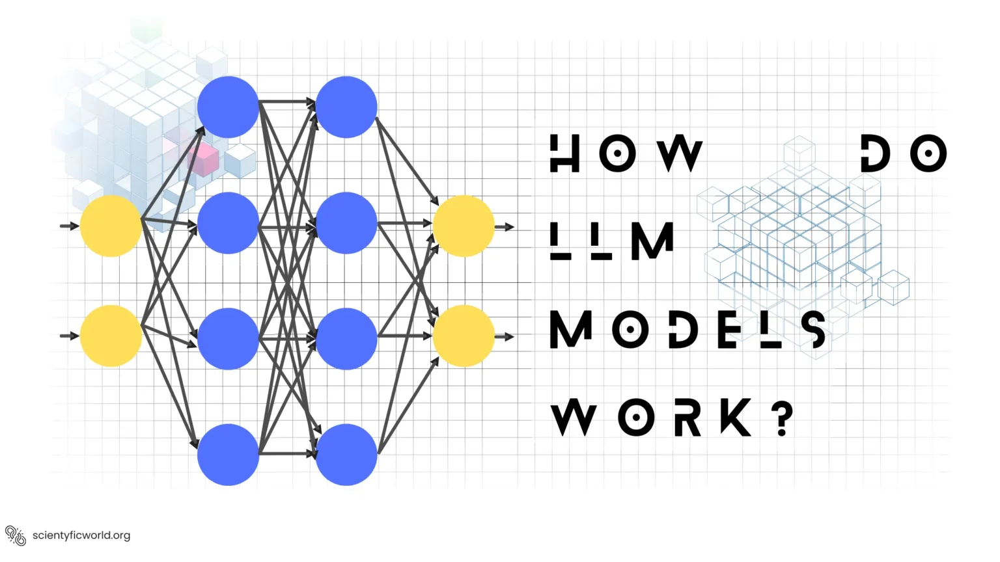

# How do LLM-s work?

<figure>
  
  <figcaption>source: https://scientyficworld.org/how-do-large-language-models-work/ </figcaption>
</figure>

LLM-s are a dynamically developing field of artificial intelligence.

The main elements that significantly improved the tasks involving processing sequences, such as natural language processing, turned out to be a deep learning architecture called **transformer** and the **attention mechanism**.

 