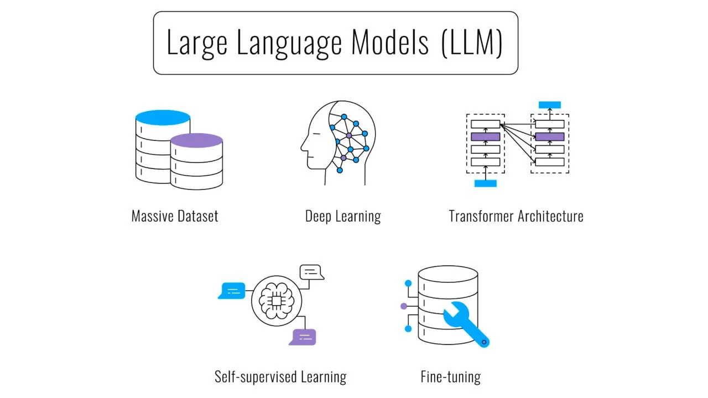

<figure>
  
  <figcaption>source: https://em360tech.com/tech-article/large-language-model)</figcaption>
</figure>

Just like with learning any new skill, also the LLM-s need to undergo a training process first to develop their full potential. The LLM training consists of a few stages and the results of the training need to be evaluated afterwards.