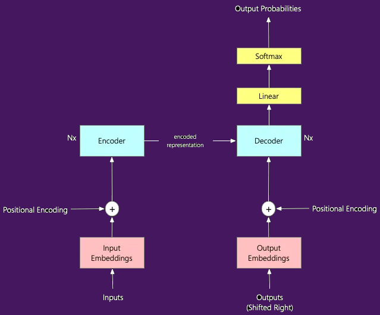

# Transformer architecture

The fundamental element of the large language models that turned out to be a game changer in the field of generative AI is the so-called **transformer architecture**. It was introduced in the paper "*Attention is all you need*" published in December 2017.

The simplified version of the transformer architecture looks like this:

