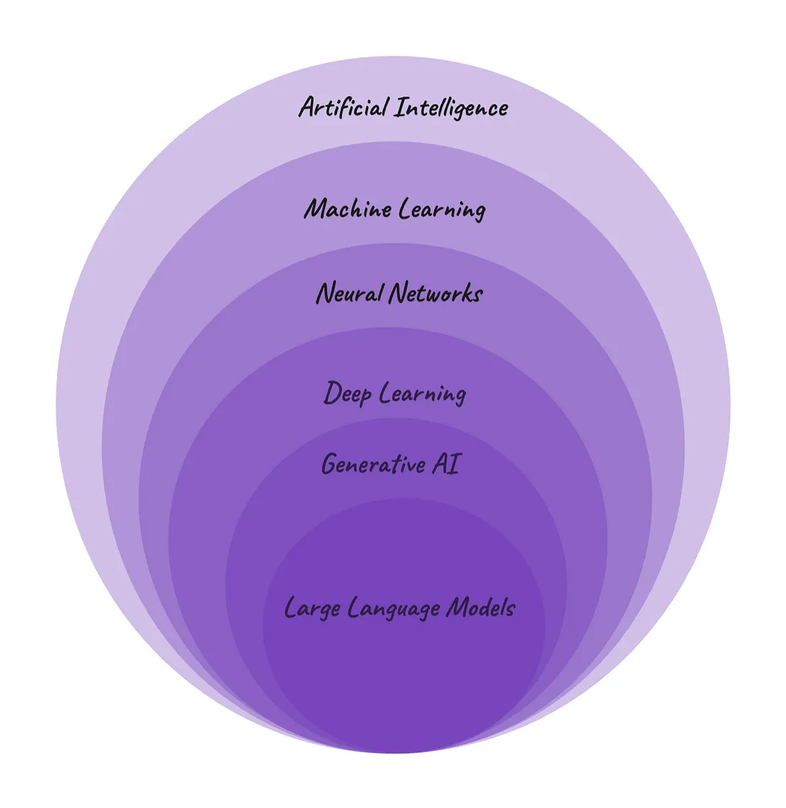

# What are LLM-s?

 LLM-s are a bit like ogres. Why? Because ogres are like onions. <q>Onions have layers. Ogres have layers.</q> So do LLM-s :)

In a broad sense large language models are an example of **artificial intelligence (AI)** because they aim to simulate human intelligence and skills in a computer system. LLM-s are able to perform language tasks like conversational dialogue, translations or content creation, just like humans do.

Moving on to the next level, LLM-s are an example of a subset of AI called **machine learning (ML)** understood as learning from big amounts of data to make predictions. Large language models predict what word comes next in a sentence based on the probability.

LLM-s also use artificial **neural networks** that mimic the way human brain cells (neurons) work. Just like neurons form a highly interconnected network and send electrical signals between each other to process information, so do artificial neural networks cooperate to solve different tasks.

Neural networks make up the backbone of the **deep learning** architecture. It is called "deep" because it consists of several (for example several dozens) hidden layers that learn from the vast amounts of data.

At its core, LLM-s are **generative AI**. Generative AI are deep-learning models that can generate high-quality content, such as texts, images, audios, videos etc. based on the data they were trained on.

 
 
